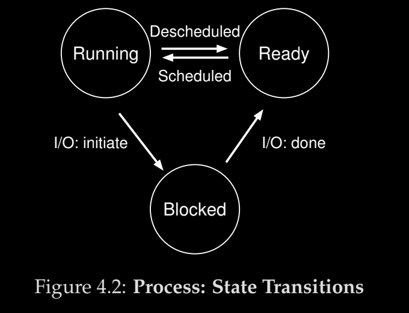
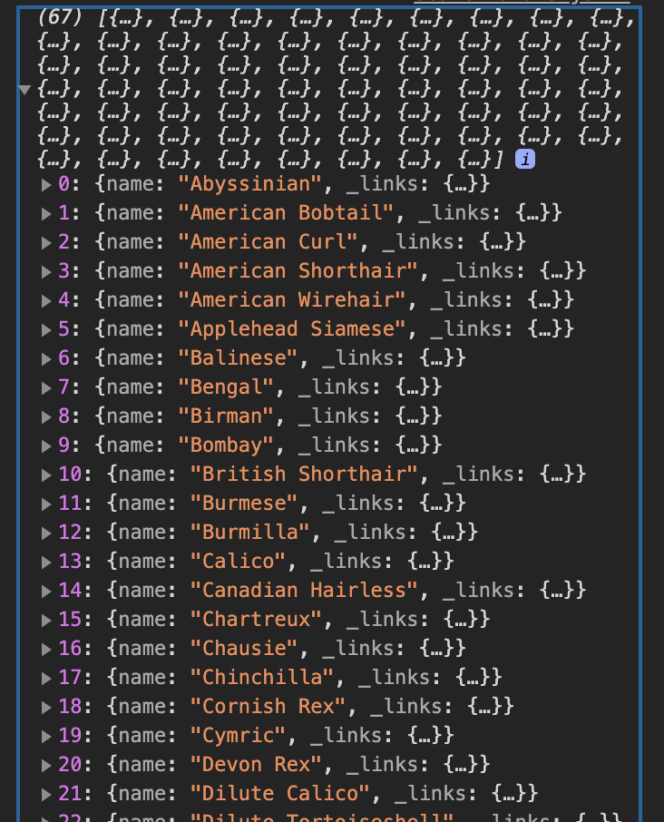
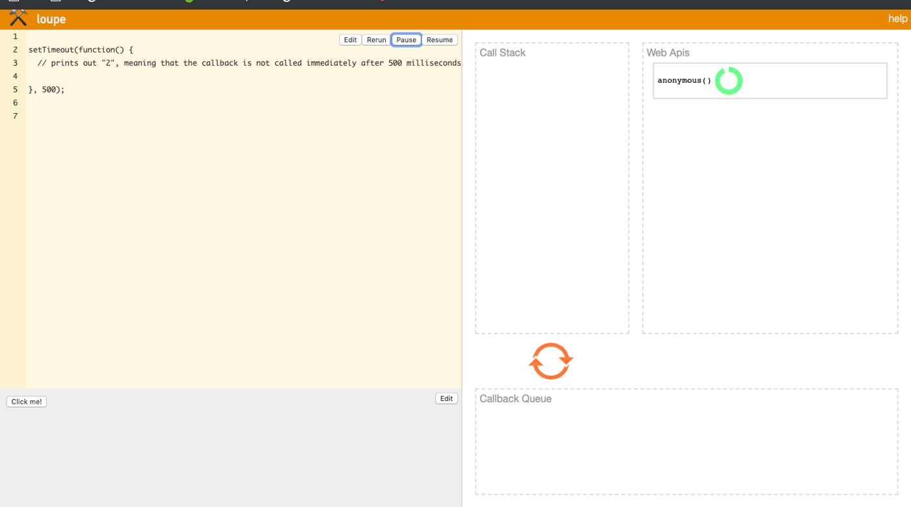

> I'd recommend just searching for things you need here
> Big tip: on a mac you can use control + cmd + space to insert emojis ⛹🏽⛹⛹

> Where I'm at now:
> Frontend: Web components
> Backend: OS

# Backend:
### Internet 
- Internet https://www.youtube.com/watch?v=x3c1ih2NJEg :heavy_check_mark:
  - protocols:
      - TCP/IP: Transports data
      - Http/https: Web access
      - RTP: Live video, Streaming and VOIP
- HTTP https://www.youtube.com/watch?v=eesqK59rhGA
  - Stateless and connectionless: the client and server don't keep any kind of state or connection to remember each other
  - Request/Response structure: 
    - Startline: GET posts/specialPost, of the format, method URI, all the headers have MIME types
    - Body
    - Headers
      - MIME Types: just a standardized format for http header types : https://stackoverflow.com/questions/3828352/what-is-a-mime-type/3828381
- Browsers https://www.youtube.com/watch?v=WjDrMKZWCt0 :heavy_check_mark:
  - User Interface 
  - Broswer engine
    - V8 https://www.youtube.com/watch?v=KM9coMpy5sQ&loop=0  :heavy_check_mark:
      - Diagram https://hackernoon.com/hn-images/1*N6eUu1Wy0xyu7dR54Pn5bQ.png :heavy_check_mark:
  - Rendering engine
    - Networking
    - JS interpreter
    - UI backend
  - Data persistence
- DNS & Domain name https://www.youtube.com/watch?v=mpQZVYPuDGU :heavy_check_mark:
  - Servers involved(in order)
    - Resolver/ ISP (has a caching layer)
    - TLD
    - Root server
    - Authoriative name server
  - Top level domain name : .io
  - Second level domain name : vigneshkarthikeyan
  - Sub domain : Subdomain
- Hosting https://www.youtube.com/watch?v=0hGK7qiQ6WA :heavy_check_mark:
- SSL https://www.youtube.com/watch?v=rROgWTfA5qE&loop=0 :heavy_check_mark:

### Basic Front End
- HTML https://www.youtube.com/watch?v=UB1O30fR-EE :heavy_check_mark:
  - Inline vs block level elements
  - < !DOCTYPE html >
- CSS https://www.youtube.com/watch?v=yfoY53QXEnI :heavy_check_mark:
  - Selector { property: value; } 
    - .class-name{ } for classes
    - *{ } for everything
    - **grail** has every other selector: CSS game http://flukeout.github.io/ :heavy_check_mark:
  - Box model, from inside to out: 
    - Content
    - Padding : TRBL 
    - Border
    - Margin : TRBL 
  - *advanced* Sass Course https://www.youtube.com/watch?v=IFM9hbapeA0&list=PLillGF-Rfqba3xeEvDzIcUCxwMlGiewfV&loop=0
- Flexbox
  - https://css-tricks.com/snippets/css/a-guide-to-flexbox/  :heavy_check_mark:
    - Flex-flow is shorthand for flex-direction and flex-wrap
  - **Grail** https://flexboxfroggy.com/ :heavy_check_mark:
- Responsive Design https://www.youtube.com/watch?v=fgOO9YUFlGI&list=PLoYCgNOIyGABDU532eesybur5HPBVfC1G&index=9&loop=0  :heavy_check_mark:

### OS and General Knowledge < DO THIS!
- OStep, skim this: https://drive.google.com/file/d/1iPD0JzZ5OSvIS03e_PkymYf4ySEeGjQX/view?usp=sharing (you are on chapter 11)
    - How do OSes work? Virtualization, Concurrency and Persistence  :heavy_check_mark:
    - Process Management
      - Process API: Create, Destroy, Stop, Start, Wait, Status.
      - Create: Modern OSes lazy load the important bits of an EXECUTABLE program from an SSD into memory
      - Memory Allocation in the form of a heap(user allocated, ex: malloc) and a stack(stores argc and argv array on initialization). 
        - requires Paging and Swapping.
      - Each process has 3 file descriptors STDERR, STDIN, STDOUT
      - Process states: 
        - running
        - blocked 
        - ready
        
      - Some OS APIs
        - fork() - creates a parallel process of the program which it was called from
        - wait() - let's the parent wait for the child process to finish(also provides determinism)
        - exec() - runs a different program using the same process
    - Threads and Concurrency
      
    - Memory Management
      - Heap
        - malloc() stores in heap, free() releases it
        - How can i not call free() when I run a short-lived program?
          - Well, the OS gives you two abstract layers of the memory, some for the process AND some within each process. So for shorter-lived programs not calling free is okay because the OS frees the process and the heap was created in the second level of abstraction, the per process memory. 
      - Segmentation 
        - Storing Code, Stack and Heap in ways that allow minimal space wastage
        - Paging 
          - Storing data in pages
        - Swap space
          - Location of virtual memory save to swap pages 
      - Page fault
        - When a page is not available in virtual memeory it looks send a page fault or a page not available and fetches the page from the physical memory
      - Pages are replaces as required using a page replacement policy
      - Workloads of policies and their performance
        - No locality
        - 80-20 workload
        - looping workload
      - TLB
        - provides the system with a small hardware cache of address translations
      - Address translations
        - Converts memory addresses to physical addresses
    - Interprocess Communication
    
    - I/O Management
    
    - POSIX? 
      - standards that ensure compatibility when moving between OSes
      - stdin, stdout, stderr and pipes: https://www.howtogeek.com/435903/what-are-stdin-stdout-and-stderr-on-linux/
      - Unix v. Linux, neither are OSes: 
      - Unix: Solaris, BSD, MacOS
        - an entire OS
      - Linux: Ubuntu, fedora, debian, android
        - just a kernel that is "distro"'d.
    - Terminal commands: 
      - grep
      - awk
      - sed
      - lsof
      - curl
      - wget
      - tail
      - head
      - less
      - find
      - ssh 
      - kill

### Learn a language
- Okay i just got the shaft in an interview for not knowing js well enought. Qs?: What are promises, Event loop, What really is node.js.
- I'll post links from the bookmarks.

### Relational databases
MySQL: https://www.udemy.com/course/mysql-and-sql-from-beginner-to-advanced/learn/lecture/5050050#overview
- The freecodecamp course is good for postgres. 
- Need to answer questions like what are relational databases and why use them.(ACID) 
- Did you know mongo was eventually consistent

# FrontEnd

### Internet :heavy_check_mark:

### HTML
Semantic HTML 
- https://www.lifewire.com/why-use-semantic-html-3468271 *TODO*
Forms and validation:
- not sure what i don't know here
Conventions and best practices: 
- same^
Accessibility: 
- ?
SEO Basics: 
- ?

### CSS
Responsive design and media queries: https://www.youtube.com/watch?v=fgOO9YUFlGI&list=PLoYCgNOIyGABDU532eesybur5HPBVfC1G&index=9&loop=0  *review*
FEM 1:
  - Responsive Design:
    - Flexible Grid Based Layout
    - Media-Queries
    - Images that resize
  - Floats
    - Hack for layout
    - "The float property is used for positioning and formatting content e.g. let an image float left to the text in a container."
  - box-sizing: border-box (uses the border box model that includes the width of the content, border and margin all in to the box.
    - make everything inherit it:
    *, 
    *:before, 
    *:after {
     box-sizing: inherit;
    }
  - col-md-4?
    - bootstrap syntax
    - md: width of page is  >= 768 px
    - 4: spans 4 of the twelve columns in the page

### JS
Fetch api
- Axios

### Version Control :heavy_check_mark:

### Web security
- Not done much besides owasp, cors and https, do more of the latter two(check out the guide from the backend section)

### CSS Architecture
- BEM
  - v good: https://youtu.be/er1JEDuPbZQ

### CSS Preprocessor
- Sass
  -  https://www.youtube.com/watch?v=Zz6eOVaaelI :heavy_check_mark:
  - Don't try and use it. CSS in is is so much more intuitive.

### Build Tools
#### Task Runners
Npm scripts :heavy_check_mark:

#### Module bundlers
Parcel baby!

#### Linters and formatters
- Prettier plugin
- eslint files or jetbrains plugin

### Pick a Framework : 
#### React
FEM React https://btholt.github.io/complete-intro-to-react-v5/
  - useEffect hook , need to declare dependencies or it will 'useEffect' every time render is called.
  - dropdowns are great for custom hooks
  - useEffect replaces the lifecycle methods
  - general js, but if you get a map back that looks like :
    

  
  you can get just the names from it by using destructuring:
  const breedStrings = breeds.map(({name}) => name)
  
  - One-way data flow: children never cause parents problems, just like real life, amiright?
  - Arrow functions and this in component lifecycle.
  - static getDerivedStateFromProps, takes in a set of props and gives you a new set of state. 
  - Need an event listener? use arrow functions and you won't need a bind
  - Modals are what popups that ask are you sure are called.
    - Trap focus of a modal: https://tinloof.com/blog/how-to-create-an-accessible-react-modal/
    - Oh, and i've got a pretty great modal that i've starred.
  - **grail** All of the advanced topics(16+) here are siloed so you can just use what you need(redux, TS, testing): https://btholt.github.io/complete-intro-to-react-v5/
    - If you want to learn anything, download the parent repo from the master branch and each section uses that as a fresh start.
   - Redux saga is for async use of redux
   - **grail** super useful break up of what react is and what it's not(as opposed to angular).: https://amp.reddit.com/r/webdev/comments/clghfx/angular_vs_react_which_would_you_choose_in_2019/

#### Vue
Nuxt: essentially Next for Vue, Gives you SSR and code-splitting(basically treeshaking for your library)

How to learn: Just go through the Vue docs. 

Vshow v vIf: Vif mounts and unmounts components which can be expensive, so it's good for large components with less toggles. V show on the other hand is for lots of toggles/ smaller components.

Slots are essentially like props except you can pass in tags too

using props with the : (short for v-bind) will let you pass in state and without will just pass in the literal in the component tag

#### State management
- need to do the FEM Redux course
- Context :heavy_check_mark:

### Modern CSS
- find a class on emotion, FEM has one

### Composition API
- Essentially react's hooks

# Interview Questions:
## JS
- 10 points i should check out sometime:
  https://medium.com/javascript-scene/10-interview-questions-every-javascript-developer-should-know-6fa6bdf5ad95
  
- Essential JS interview questions
  https://medium.com/javascript-scene/master-the-javascript-interview-what-s-the-difference-between-class-prototypal-inheritance-e4cd0a7562e9

- What is a javascript?
  A single-threaded non-blocking I/O, Concurrent language. (concurrent meaning able to **run** multiple process at the same time as opposed to parallel that allows the **starting** of two proceesses at the same time. k, so what's the IO part, just the requests being the output and their responses being the input. Single threaded? we can dive into the event loop and how all of that is handled.
  
- What is lazy evaluation?
  Calling a function using FP's first order functions and closure's we can create a lazily evaluated function that runs only as required. This is useful for functions that are super heavy and so just running them at the time they are needed is a good idea rather than starting them early. https://www.codementor.io/@agustinchiappeberrini/lazy-evaluation-and-javascript-a5m7g8gs3. If you run the function twice do you need to actually run it twice. No cause memoization. 
  

- What is the event loop?
  Part of the engine but control over it is give to the runtime as well.  
  
- What's the difference between the JS runtime and engine?
  A JS program must do two things:

   - parse your code and convert it to runnable commands
   - provide some objects to javascript so that it can interact with the outside world.
  The first part is called Engine and the second is Runtime.

  For example, the Chrome Browser and node.js use the same Engine - V8, but their Runtimes are different: in Chrome you have the window, DOM objects etc, while node gives you require, Buffers and processes.

- What is asynchronous programming?
  Synchronous programming is a program that blocks for long processes like disk IO and network requests. Au contraire, A-synchronous programs do not wait, they pass the, otherwise blocking, sections of the code on to the callstack where they are let to run to completion if they can using the engine, and if not they are passed to web APIs provided by the Runtime(think DOM in the front end and Require in the backend). On completion they can't just go straight back to the call stack so they are moved to a message queue called a task/callback queue. This then pushes the completed callback over to the call stack where it finally get's to run.

- Can you name two JS paradigms?
  Javascript allows you to program procedurally(think like C) with OOP if you chose to. Also functionally. The OOP is supported by prototypal inheritance.
  Prototypical OOP in JS: https://medium.com/javascript-scene/the-two-pillars-of-javascript-ee6f3281e7f3
  Functional programming in JS: https://medium.com/javascript-scene/the-two-pillars-of-javascript-pt-2-functional-programming-a63aa53a41a4
  
- Class inheritance vs prototypical inheritance?
https://medium.com/javascript-scene/master-the-javascript-interview-what-s-the-difference-between-class-prototypal-inheritance-e4cd0a7562e9

  You essentially get an object and thus can just the parts of the object that you need and not have access to everything else. With Class inheritance you *always get the entire class delegation hierarchy*. This means sometimes you might want just the banana but might get the gorilla holding it and the whole jungle with it too. 
  - There's three types that **todo** don't know. Need to find out what mixins and prototypes are:
    - https://developer.mozilla.org/en-US/docs/Learn/JavaScript/Objects/Object_prototypes
    - https://javascript.info/mixins
  
  - Is classical inheritance every okay?
    A single level is sometimes OK, from a framework base-class such as React.Component.

- What are two-way data binding and one-way data flow, and how are they different?
 - two-way data binding is essentially the ui mapping the model data, in react, the state and vice versa.
 - one way data flow references the fact that the model is the single source of truth and all changes in the ui head towards it.

- What does “favor object composition over class inheritance” mean?
  You essentially avoid all the weaknesses of OOP
    - The weak base class problem
    - Avoid creating a class hierarchy

- What tings do you get with a functional programming language?
  first-class functions, Closures, Higher-order functions

- What is a promise?
Todo: https://medium.com/javascript-scene/master-the-javascript-interview-what-is-a-promise-27fc71e77261

- Wtf is a Closure?
  - So in js, functions form closures. So when you create a function, it stores the entire lexical scope along with the function itself. This is pretty rad cause you can do this:
    function init() {
      const name='Mozilla';
      function displayName() {
          console.log(name);
      }
      return displayName;
  }

  const functionVal = init();
  functionVal(); // this will actually printout 'Mozilla' :O
  
  - K, so it can also be used to create a function factory:
      function makeBirthday(name) { //wow this is sad
        return function() {
          console.log("Happy Birthday" + name)        
      }
      
      makeBirthday("Vignesh")
  
    but what's way cooler is using it to create private methods
    var counter = (function () {
      var privateCounter = 0;
      function changeBy(val) {
        privateCounter += val
      }
      
      return{
        increment: function() {
          changeBy(1)
        },
        decrement: function() {
          changeBy(-1)
        },
        value: function {
          return privateCounter;
        }
      }
    
    })();
    
    console.log(counter.value()); // 0
    
    counter.increment();
    console.log(count.value()); // 1
    
    
   You can use closure scope chains like:
       var e = 10;
    function sum(a){
      return function(b){
        return function(c){
          // outer functions scope
          return function(d){
            // local scope
            return a + b + c + d + e;
          }
        }
      }
    }
    
    to require values to be put in in order and not return anything unless they are there.
    
  
  - Docs:
      - Can be used to create function factories: https://amp.reddit.com/r/learnjavascript/comments/cgumqm/i_understand_how_closures_work_but_i_dont/
      - Can be used to create encapsulation: https://medium.com/javascript-scene/master-the-javascript-interview-what-is-a-closure-b2f0d2152b36
      - https://www.youtube.com/watch?v=3a0I8ICR1Vg
      - todo: https://developer.mozilla.org/en-US/docs/Web/JavaScript/Closures

- What is a higher-order function?
todo: https://eloquentjavascript.net/05_higher_order.html
Essentially a function that takes in two functions as parameters and returns a combined function

- move to correct location: TCP /(over) IP: https://www.cloudflare.com/en-in/learning/ddos/glossary/tcp-ip/
- What is a promise?
  - A promise is a returned object that you attach a callback to to get the response of an asynchronous operation. It's different from a callback because it gives you guarantees of responding with either success or failure. 
  - Did you know the thing( the function lol ) that you pass into setTimeout is a callback, and shitty old APIs might not already return promises. If you instead wrap the two weird things in a promise like const wait = new Promise(setTimeout(doSomething, 1000)). You can just run wait and should probably only do that to deal with the code. 
  - K so that syntax was off, it's actually like this const wait = ms => new Promise(resolve => setTimeout(resolve, ms));
  - Always return results, ms => new Pro... is short for function (ms) { returns new Pro... }
  - So what is a promise?
    ~~It's a callback that is used to wrap another callback. I honeeestly don't know okkekekke. Let me read callbacks and see if I get it. if not the medium.~~
    *So a promise is an object wrapper for a callback. It gives you guarantees of completion and can be chained.* 

- What is a callback?
  - A function that is passed into a function and then called by the function that did the passing in(the outer function).
  A shitty but i guess kind of clear example of how annoying callbacks are:
 
 function greeting(name) {
  alert('Hello ' + name);
}

function processUserInput(callback) {
  var name = prompt('Please enter your name.');
  callback(name);
}

processUserInput(greeting);

 - K so how is this tied into what a promise is. So a promise wraps all of this in a callback and is an object that represent it. so by doing so you can just call the parent Obect and say .then and it will essentially guarantee the nastiness that is callbacks is done(success or not). Ew. But i see why promises are so loved. Because they give you an object interface that can be passed around a lot easier than callbacks.

- What is lazy eval?
https://www.codementor.io/@agustinchiappeberrini/lazy-evaluation-and-javascript-a5m7g8gs3

- What is prototypal inheritance?
  Inheritance using the built in prototype object in JS rather than classes because of thing like the weak base class problema and the banana problem(the whole gorilla)

- Where do you store a JWT on the front end?
  in http-only cookies so that they are safe from XSS. They can be set by the server by sending a Set-Cookie header. A 'Secure' and 'Http' flag can also be made necessary so that they prevent Man in the middle attacks and XSS respectively. 
  
https://stormpath.com/blog/where-to-store-your-jwts-cookies-vs-html5-web-storage
https://developer.mozilla.org/en-US/docs/Web/HTTP/Cookies
  
- What did you learn from the two pillars?
  - FP and it's uses, higher order functions being used to take two functions together and combine them, closure used to encapsulate and create contract factories, Lazy loading that is enabled by closures and first class functions together allows you to run an expensive function only when it is needed and cache it for later usage. First order functions which enable functions to be passed into other functions as objects.
  - Prototypical inheritance

- How does TLS work?
https://medium.com/iocscan/transport-layer-security-tls-ssl-8e02b6d1d648
Client says hello(and it's available encryption ciphers), server responds with it's certificate(and chooses the most secure cypher available), client verifies the certificate with certificate validating authority. Client and server agree on keys and exchange keys. Http request is encrypted with symmetric key. response is encrypted with symmetric keys. 

- How does Http work? Over tls in a client-server fashion.

- Cookies vs Local storage?
Cookies are essentially used only by the server side and local storage is only used by the front end.

- What is a first-class function?
  Apparently when you can pass a function into another function it's then called a first class function. Essentially they inherit from JS's Object and thus can be passed around like one.

- How is lambda calculus related to functional programming? Does it have anything to do with lambda calculus? ( Church as opposed to Turing baybee).
Functional programming is heavily based on lambda calculus. Func. prog. uses pure functions and thus avoid side-effects. A lambda function isn't really related, it's just a function with no name.

- What is a pure-function?
  They are all about mapping inputs to outputs. Get that? *A fixed input always returns a fixed output*. So there's no shared state and thus they can be used to avoid tons of bugs. some examples are map, reverse, find, maybe a custom forloop fp.

- Pure functions don't cause any side effects? what's a Side effects?
  Side effects just mean that running the function will not affect the state outside the function.
  

- Okay I really really want to do anything in my power to understand functional programming, how do? 
https://softwareengineering.stackexchange.com/questions/130722/what-is-the-difference-between-a-function-and-a-lambda

Turing-Church and their relation and their work turing into the two paradigms of computing we have today still get's me ~~hard~~ excited to this day. 

## Fem
https://frontendmasters.com/books/front-end-handbook/2018/practice/interview-q.html

# Bonus(Common to both)
- Postgres to Mongo or vice versa?
  - https://docs.mongodb.com/manual/reference/sql-aggregation-comparison/
  - https://docs.mongodb.com/manual/reference/sql-comparison/
- SOA: Service oriented architecture, different from Microservices with regard to scope; SOA at the enterprise level and microservices at the application level.
- **grail** How to setup a fullstack app on AWS(says MERN but i've used it for PERN ): https://jasonwatmore.com/post/2019/11/18/react-nodejs-on-aws-how-to-deploy-a-mern-stack-app-to-amazon-ec2
- How people are using lodash in 2020:
   - "I don't use it for chain, clone, each, map, filter, or reduce. I still use it for at, has, chunk, groupBy, uniqBy, intersection, flatten, cloneDeep, debounce"
- AWS Security **grail** https://www.youtube.com/watch?v=-ObImxw1PmI
  - This thing actually went over internet gateways as well! and VPC, KMS, and IAM.
- EPI: https://drive.google.com/file/d/1xtKQE5VLdY8AUsAJDKr-dAjLcEkhv6J1/view
- AWS webdev, **grail** https://www.udemy.com/course/networking-in-aws/
- *Bonus* Networking https://www.homenethowto.com/
- Subnets https://docs.aws.amazon.com/vpc/latest/userguide/VPC_Subnets.html
- Security https://expeditedsecurity.com/api-security-best-practices-megaguide/
- AWSinPlainEnglish  https://expeditedsecurity.com/aws-in-plain-english/
  - checkout waf
- find out what those old tunnel files are/did (from oldStuff)
- learn about message queues and use them better
- Distributed auth
  - AuthO : This is basically just an embeddable login blade
  - Passport : Auth with other stuff. 
  - command + 1 to open project in webstorm and command + n to open a new file. 
  - JWT :
    - https://www.youtube.com/watch?v=894seNhONF8&loop=0 :heavy_check_mark:
    - https://www.youtube.com/watch?v=2jqok-WgelI&loop=0 (use this for sessions)
    - Lookup refresh tokens and all that, extending token length https://stackoverflow.com/questions/26739167/jwt-json-web-token-automatic-prolongation-of-     expiration?rq=1
  - **Holy Grail** Distributed/ Load balanced servers and need to keep servicing Request with JWT(in English, if you have multiple servers, the server keeping track of the auth might not be the same server that has low load and will serve a future request. so you just share have a **shared secret**. The private key for the jwt). This apparently is called symmetric encryption. 
  - Refresh tokens: https://auth0.com/blog/refresh-tokens-what-are-they-and-when-to-use-them/
- Watch tech interviews: https://interviewing.io/recordings/
- JS runtime environment: https://medium.com/@olinations/the-javascript-runtime-environment-d58fa2e60dd0
- JS memory model: https://medium.com/@ethannam/javascripts-memory-model-7c972cd2c239#:~:text=For%20the%20purposes%20of%20this,in%20addition%20to%20function%20calls).&text=Now%2C%20the%20heap.,where%20non%2Dprimitives%20are%20stored.
- API Security: https://expeditedsecurity.com/api-security-best-practices-megaguide/
- Cookies, sessions and it not being RESTful and why you should still do it: https://stackoverflow.com/questions/6068113/do-sessions-really-violate-restfulness 
- Alternative roadmap, this kinda includes both: https://www.youtube.com/watch?v=IFM9hbapeA0&list=PLillGF-Rfqba3xeEvDzIcUCxwMlGiewfV&loop=0
- Regex: https://www.regular-expressions.info/quickstart.html
- All my flashcards: https://www.cram.com/dashboard-flashcards#flashcards
- A lot of content for my PM interviews and other stuff in Onenote 
- Tf is a polyfill/ How do I get old browsers to run my code(ans, transpile for the new stuff, polyfills for classes : https://medium.com/hackernoon/polyfills-everything-you-ever-wanted-to-know-or-maybe-a-bit-less-7c8de164e423#.p1y2v1ujy
- CORS: 2nd comment https://www.reddit.com/r/javascript/comments/8rn8ja/i_dont_understand_how_cors_works/
  - only done by the browser, so postman/fetch all that works.
  - Origin refers to the (i think at the website level, a different website) thing that is different from the endpoint. bleh.
  - looks 
- SASS: *Grail* Use SASS it's easy https://www.youtube.com/watch?v=Zz6eOVaaelI
  - Mixin: Just like functions, you could use a *mixin* to set the default properties for flexbox: display, justify-content, align-items @12:00
    - Damn, it's so goooood. You can even pass it variables and set flex-direction dynamically if you want.
    - what a mixin actually does is take methods from a class and assign them to the current class.
- Symmetric key v Asymmetric: basically asymetric has a private key and a public key. 
- Emmet: *Grail* Want to get better with code completion, this is how it's done!
- ESLint: npm i -D eslint eslint-config-prettier (more for syntax)
- package-lock.json: for production releases. packages can be installed using npm ci and will result in exact version rather than ^***
- YDKJS **GRAIL** Kinda dry but here's a tip. Everything in the world is boring without context. Imagine trying to explain something you love that's just not interesting sounding to someone else. The difference is not that they are not interested. It's that they don't know enought about it. So if you want to teach someone about how great headphones are, tell them to play an instrument, play music, listen to it for years, play concerts, obsess about it, dream about making it better objectively and how better headphones make it easier for you to make better music becomes obvious. So how do you reproduce that you could method act and become the writer with enough information. I'm gonna try that.
  - The three pillars
    - Read this got scope and closures: https://dev.to/danvyle/javascript-fundamentals-101-scope-and-closures-352g#:~:text=A%20closure%20is%20the%20combination,created%2C%20at%20function%20creation%20time.

- Should I be using Microservices: https://www.reddit.com/r/programming/comments/d2x8nn/learning_the_hard_way_microservices/
   - Conway's Law
   
-   Serialization is to provide a convenient form for data to be passed from one place to another. Use JSON.stringify to turn a JSON object(something not super convenient to transmit into a string with no spaces. And receive it and used JSON.parse to turn it back into a JSON object.

# Other niceties:
- Keeping SSH from disconnecting: https://superuser.com/questions/699676/how-to-prevent-ssh-from-disconnecting-if-its-been-idle-for-a-while
- nginx conf check: nginx -t -c /etc/nginx/nginx.conf
- http extension
- pyenv is used to manage multiple python versions(you know, in case you need 2 and 3 sometimes(also, why tf is python 2 the default on OSX)).

